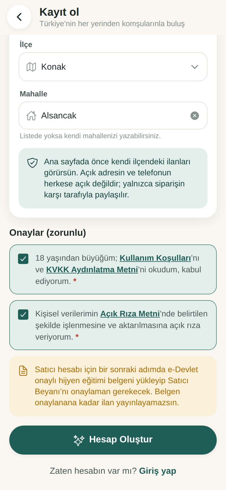
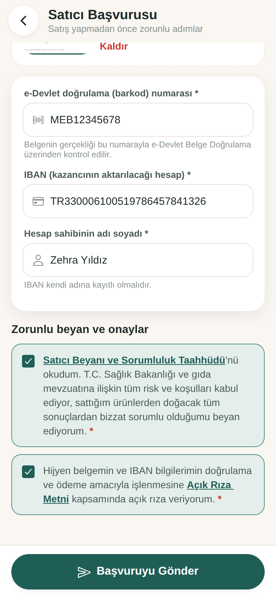
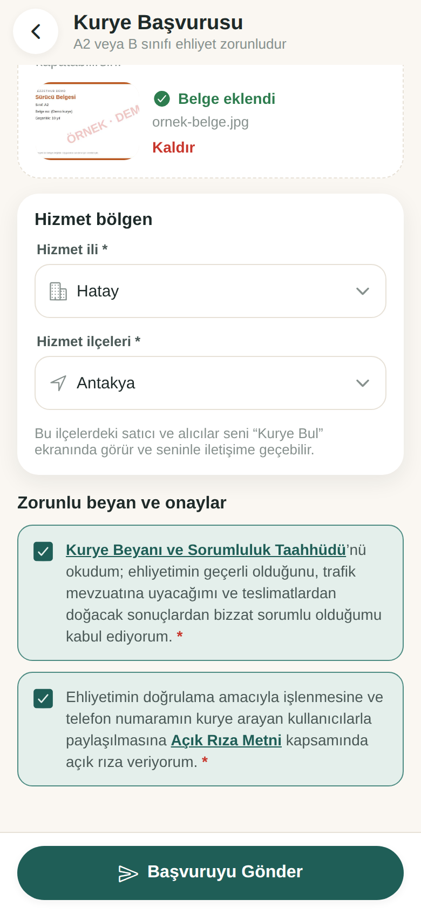
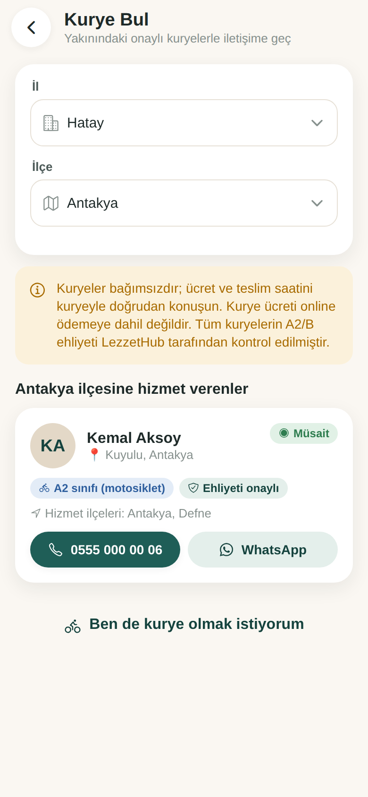
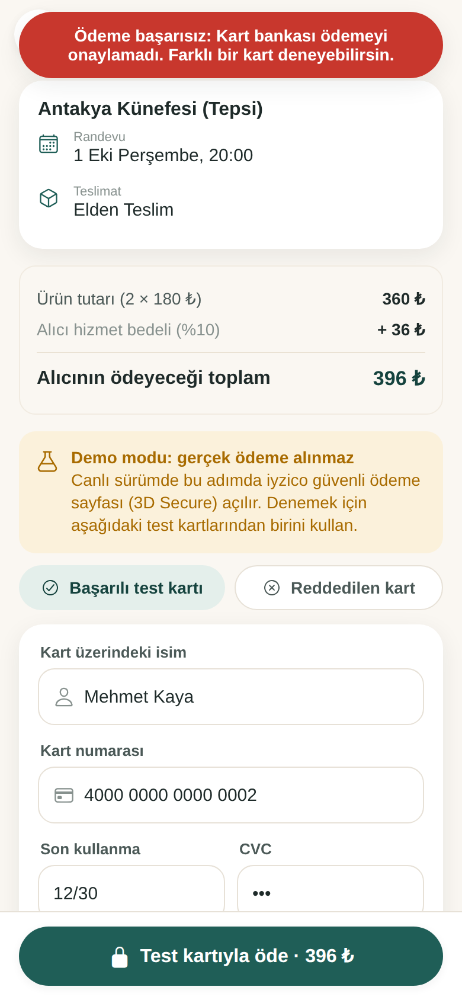
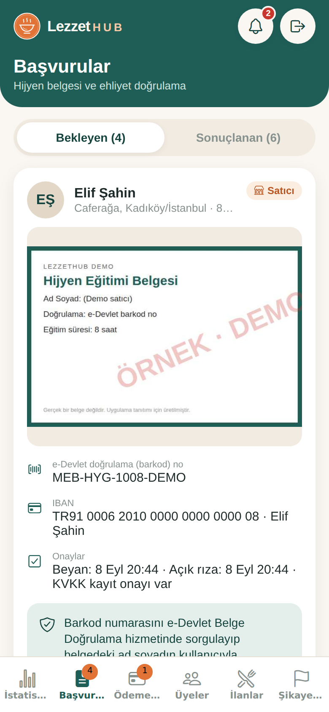
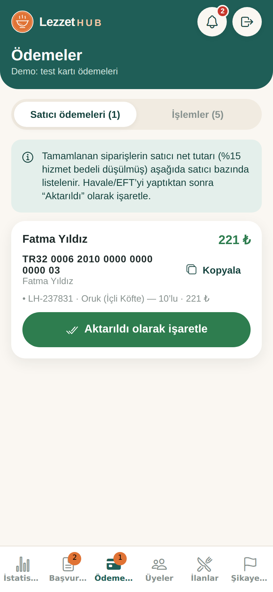
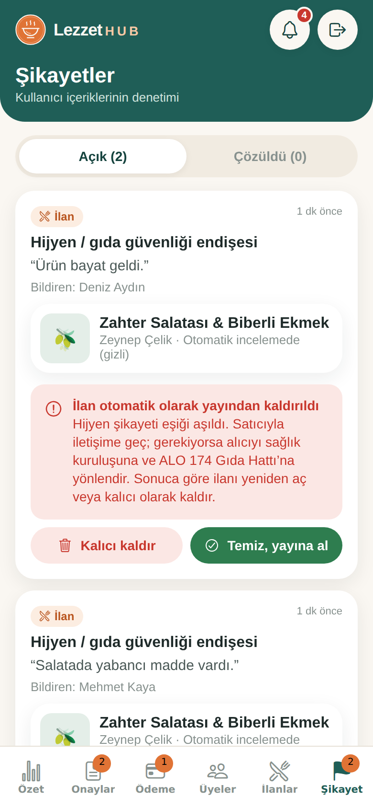

# LezzetHub — Türkiye’nin Ev Lezzetleri

Türkiye’nin 81 ilinde ev yemeği satıcılarıyla alıcıları **il + ilçe + mahalle** detayında buluşturan marketplace mobil uygulaması. Öne çıkanlar:

- randevulu sipariş; **pilot modda teslimatta ödeme** (şirket gerekmez, komisyonsuz), hazır olunca tek ayarla **online ödeme** (iyzico)
- teslimat için **elden, kurye veya kargo**; kurye/kargo ücretini alıcı ya da satıcı üstlenir
- **onaylı kurye rehberi**
- satıcılar için **zorunlu hijyen belgesi, gıda işletmesi kayıt numarası** ve mevzuat beyanı
- gıda güvenliği kuralları: zorunlu alerjen ve son tüketim bilgisi, yasaklı ürünler, kargoda yalnızca dayanıklı ürün, hijyen şikayetinde otomatik yayından kaldırma

Expo (React Native) + Expo Router + TypeScript ile yazıldı; iOS, Android ve web’de çalışır. Veriler **Supabase** (PostgreSQL + Auth + Storage + Realtime + Edge Functions) üzerinde tutulur. Supabase ayarlanmadığında uygulama, cihaz içi **demo modunda** çalışır.

| Ana sayfa (kargo filtresi) | Kayıt ve zorunlu onaylar | Satıcı başvurusu | Kurye başvurusu |
|---|---|---|---|
|  |  |  |  |

| Kurye Bul | Online ödeme (demo) | Sipariş detayı | Admin: başvurular | Admin: satıcı ödemeleri | Admin: hijyen incelemesi |
|---|---|---|---|---|---|
|  |  |  |  |  |  |

---

## 1. Hızlı başlangıç (demo modu)

**Windows’ta en kolay yol:** ZIP’i çıkardıktan sonra ana klasördeki **`LezzetHub-Baslat.bat`** dosyasına çift tıkla. Gerekli paketleri kurar ve telefonla okutacağın QR kodu açar ([Node.js](https://nodejs.org) kurulu olmalı).

Elle çalıştırmak için:

```bash
cd lezzethub-app
npm install
npx expo start          # QR kodu telefondaki Expo Go ile okut
npx expo start --web    # tarayıcıda aç
```

Demo modunda giriş ekranında tek dokunuşla giriş yapılan hesaplar vardır:

- **Admin**: `admin@lezzethub.com` / `admin123`
- **Ayşe – Satıcı**, **Mehmet – Alıcı**, **Kemal – Kurye**: şifre `123456`

Demo verisinde İstanbul, Ankara ve İzmir’den satıcılar, onay bekleyen satıcı/kurye başvuruları ve kargodaki bir sipariş de vardır.

Demo verisi **pilot moddadır**: siparişlerde ödeme teslimatta yapılır, test kartı gerekmez. (Online modda demo ödemesi `4242 4242 4242 4242` test kartıyla simüle edilir; `4000 0000 0000 0002` reddedilir.)

Demo verisi yalnızca o cihazda tutulur; **Profil → Demo verilerini sıfırla** ile başa dönülür. Önceki (yalnızca Hatay) sürümün demo verisi otomatik olarak yenisiyle değiştirilir.

## 2. Canlı mod: Supabase kurulumu (yaklaşık 15 dakika)

Canlı modda tüm kullanıcılar aynı veritabanını kullanır: Ayşe’nin ilanını Mehmet kendi telefonunda görür, mesajlar ve bildirimler anında düşer.

1. **Proje aç:** https://supabase.com → ücretsiz hesap → *New project* (bölge olarak Frankfurt önerilir).
2. **Veritabanını kur:** Supabase panelinde *SQL Editor → New query*. **`supabase/kurulum.sql`** dosyasını aç, **içindeki metnin tamamını** kopyalayıp yapıştır ve **Run** de. (Dosya adını değil, içeriğini yapıştır. GitHub’da dosyayı açıp sağ üstteki “Copy raw file” düğmesiyle kopyalayabilirsin.)

   Bu tek dosya aşağıdaki dört dosyanın birleşimidir; istersen onları sırayla ayrı ayrı da çalıştırabilirsin:
   1. `supabase/locations.sql`: 81 il ve 973 ilçe (konum doğrulaması için)
   2. `supabase/schema.sql` (önceki sürümü kurduysan yeniden çalıştırman yeterli; eksik sütunları kendisi ekler): tablolar, güvenlik kuralları, sipariş/ödeme akışı, satıcı/kurye başvuruları
   3. `supabase/storage.sql`: fotoğraf kovası (herkese açık) ve belge kovası (özel)
   4. `supabase/realtime.sql`: anlık güncellemeler
3. **Kimlik doğrulama ayarları:** *Authentication → URL Configuration*
   - *Site URL:* web sürümünün adresi (ör. `https://www.lezzethub.com`)
   - *Redirect URLs:* `lezzethub://**` ve `https://www.lezzethub.com/**` ekle (e-posta doğrulama ve şifre sıfırlama bağlantıları için)
   - İstersen *Authentication → Emails* bölümünden e-posta şablonlarını Türkçeleştir.
4. **Uygulamayı bağla:** `lezzethub-app/.env.example` dosyasını `.env` adıyla kopyala ve *Project Settings → API* sayfasındaki değerleri yaz:
   ```
   EXPO_PUBLIC_SUPABASE_URL=https://xxxx.supabase.co
   EXPO_PUBLIC_SUPABASE_ANON_KEY=eyJ...
   ```
   Uygulamayı yeniden başlat (`npx expo start -c`). Giriş ekranındaki demo bölümü kaybolur, "Şifremi unuttum" görünür.
5. **İlk admini ata:** Uygulamadan normal şekilde kayıt ol. Ardından `supabase/make-admin.sql` içindeki e-postayı kendi adresinle değiştirip SQL Editor’de çalıştır. Diğer adminleri uygulamadaki **Admin → Kullanıcılar** ekranından atayabilirsin.

6. **(İsteğe bağlı) Online ödeme:** Pilot modda gerekmez. Şirket ve iyzico hazır olunca aşağıdaki bölüme bak.

### Ödeme modu: pilot (varsayılan) ve online

Uygulama varsayılan olarak **pilot modda** çalışır:

- Ödeme uygulamadan geçmez; alıcı teslimatta doğrudan satıcıya öder (nakit veya IBAN).
- Hizmet bedeli alınmaz. Sipariş akışı: Satıcı onayı → Onaylandı · Teslimatta ödeme → Tamamlandı.
- Şirket, iyzico hesabı veya ödeme fonksiyonları **gerekmez**. LezzetHub bu modda yalnızca alıcıyla satıcıyı buluşturan bir ilan platformudur.

**Online ödemeye geçiş** (şirket kurulup iyzico üye işyeri onayı alındıktan sonra):

1. Aşağıdaki iyzico kurulumunu yap.
2. SQL Editor'de şunu çalıştır:
   ```sql
   update public.app_settings set value = 'online' where key = 'payment_mode';
   ```
3. Bundan sonra açılan siparişler online ödemeli ve komisyonlu olur. Önceki siparişler teslimatta ödemeli olarak kalır. Uygulamayı yeniden derlemek gerekmez.

Geri dönmek için aynı komutu `'offline'` ile çalıştırman yeterli.

### Online ödeme: iyzico kurulumu (yalnızca online mod için)

Ödeme, iyzico **Ortak Ödeme Sayfası (Checkout Form)** ile alınır. Kart bilgisi uygulamaya hiç girilmez. Sonuç, sunucuda iyzico’dan tekrar sorgulanır ve imzası doğrulanır; sipariş ancak bundan sonra “Ödendi” olur. Kodlar `supabase/functions/` altındadır:

| Fonksiyon | Görevi |
|---|---|
| `payments-create` | Alıcı, satıcının onayladığı sipariş için ödeme sayfası açar (tutar sunucuda hesaplanır) |
| `payments-callback` | iyzico’nun döndüğü adres. Sonucu doğrular, siparişi “ödendi” yapar, kullanıcıyı uygulamaya geri gönderir |
| `payments-refund` | Yalnızca admin: ödenmiş siparişi karta iade eder ve iptal eder |

1. https://sandbox-merchant.iyzipay.com adresinden **sandbox** hesabı aç; API ve güvenlik anahtarlarını al.
2. [Supabase CLI](https://supabase.com/docs/guides/cli) ile gizli değerleri tanımla ve fonksiyonları dağıt:
   ```bash
   npx supabase login
   npx supabase link --project-ref PROJE_REF
   npx supabase secrets set IYZICO_API_KEY=sandbox-... IYZICO_SECRET_KEY=sandbox-... \
     IYZICO_BASE_URL=https://sandbox-api.iyzipay.com \
     APP_RETURN_URLS="lezzethub://,exp://,https://www.lezzethub.com/"
   npx supabase functions deploy payments-create
   npx supabase functions deploy payments-refund
   npx supabase functions deploy payments-callback --no-verify-jwt
   ```
   `APP_RETURN_URLS` ödeme sonrası dönülebilecek adreslerdir (açık yönlendirmeye karşı izin listesi). Web sürümünün alan adını da ekle.
3. Sandbox test kartlarıyla dene (ör. `5528 7900 0000 0008`, SKT gelecekte bir tarih, CVC `123`).
4. Canlıya geçerken `IYZICO_BASE_URL=https://api.iyzipay.com` ve canlı anahtarları tanımla.

Diğer ayarlar:

- `IYZICO_DEFAULT_IDENTITY_NUMBER`: iyzico alıcı TCKN alanını zorunlu tutar. Uygulama TCKN toplamaz; varsayılan olarak `11111111111` gönderilir. iyzico ile anlaşmanızda bu değerin kabul edildiğini teyit edin.
- `IYZICO_VERIFY_SIGNATURE=false`: yanıt imza doğrulamasını kapatır. Yalnızca sorun ayıklarken kullanın.

**Satıcıya ödeme:** Alıcının ödediği tutar platform hesabına geçer. Sipariş tamamlanınca satıcının net kazancı (%15 düşülmüş), **Admin → Ödeme → Satıcı ödemeleri** ekranında satıcının başvuruda verdiği IBAN ile listelenir. Havale/EFT sonrası “Aktarıldı” olarak işaretlenir ve satıcıya bildirim gider.

> ⚖️ **Önemli:** Başkası adına tahsilat yapıp satıcıya aktarmak 6493 sayılı Kanun kapsamında lisans gerektirebilir. Canlıya çıkmadan önce iyzico’nun **Pazaryeri (marketplace)** çözümünü kullanmanız (alt üye işyeri + ödeme bölüştürme) ve bir hukukçuya danışmanız önerilir. Bu kod standart Checkout Form ile çalışır; pazaryeri modeline geçişte `buildInitializeBody` içindeki sepet kalemlerine `subMerchantKey` ve `subMerchantPrice` eklenmesi yeterlidir.

**Güvenlik modeli:** İstemci tablolara doğrudan yazamaz. Tüm değişiklikler sunucu fonksiyonlarıyla yapılır; komisyon, sipariş durum geçişleri ve yetki kontrolleri sunucuda uygulanır. Okumalar satır düzeyi güvenlikle (RLS) sınırlıdır: e-posta, telefon ve açık adres yalnızca sahibine ve adminlere görünür, mesajları yalnızca siparişin tarafları okuyabilir. Hijyen belgesi ve ehliyet dosyaları **özel** `documents` kovasında tutulur; yalnızca sahibi ve adminler kısa süreli imzalı bağlantıyla açabilir. Ödemeyi onaylama ve iade fonksiyonları istemciye kapalıdır (yalnızca `service_role`).

## 3. Özellikler

- **Kapsam: tüm Türkiye.** 81 il, 973 ilçe ve yaklaşık 73 bin mahalle önerisi. Mahalle verisi il seçildiğinde parça parça yüklenir; listede olmayan mahalle serbestçe yazılabilir.
- **Ana sayfa:** Varsayılan olarak kullanıcının ili ve ilçesi gösterilir.
  - İl seçici (arama destekli) ve ilçe filtreleri, mahalle, metin ve kategori filtreleri
  - **Kargoyla Türkiye geneli**: konumdan bağımsız olarak kargolu ilanları gösterir
- **Kayıt ve zorunlu onaylar:**
  - Hesap türü seçilir: Alıcı, Satıcı veya Kurye.
  - Tüm kullanıcılar için iki onay zorunludur: Kullanım Koşulları + KVKK Aydınlatma Metni kabulü ve **KVKK açık rızası**. Onay tarihleri kaydedilir.
- **Satıcılar:** Satış yapmak için şunlar **zorunludur**:
  - **e-Devlet onaylı hijyen belgesi** (fotoğraf veya PDF) ve barkod numarası
  - **gıda işletmesi kayıt numarası** (İl/İlçe Tarım ve Orman Müdürlüğü, 5996 sayılı Kanun). Onaydan sonra ilanlarda ve satıcı profilinde gösterilir.
  - IBAN
  - **Satıcı Beyanı ve Sorumluluk Taahhüdü**: Sağlık Bakanlığı ve gıda mevzuatına ilişkin risk ve koşulların kabulü, sonuçlardan bizzat sorumluluk
  - belgelerin işlenmesine açık rıza

  Admin belgeyi inceleyip onaylayana kadar ilan verilemez. Onaysız satıcının ilanları sunucuda da gizlenir.
- **Gıda güvenliği (her ilanda zorunlu):**
  - Türk Gıda Kodeksi’ndeki 14 alerjen grubundan içerdikleri ya da açık “alerjen içermez” beyanı. Alerjenler ilan detayında ve sipariş ekranında uyarı olarak gösterilir.
  - Son tüketim ve saklama bilgisi.
  - **Yasaklı ürün onayı:** çiğ et, çiğ süt, çiğ yumurtalı ürünler, ev konservesi, yabani mantar, alkol, takviye ve “şifalı” ürünler satılamaz. Satıcı her kayıtta onaylar.
  - **Kargo yalnızca oda sıcaklığında dayanıklı** (soğuk zincir gerektirmeyen) ürünlerde seçilebilir. Sunucuda da kısıt olarak uygulanır.
  - **Hijyen şikayetinde otomatik yayından kaldırma:** ürünü satın almış bir alıcıdan 1 şikayet veya 2 farklı kullanıcıdan şikayet gelirse ilan hemen gizlenir.
    - Satıcı ilanı kendisi açamaz; satıcıya ve adminlere acil bildirim gider.
    - Admin, “Temiz, yayına al” veya “Kalıcı kaldır” ile sonuçlandırır.
    - Şikayet ekranında kullanıcı sağlık kuruluşu ve ALO 174 Gıda Hattı’na yönlendirilir.
  - **Gıda Güvenliği Kuralları** sayfası: `/legal/food`.
- **Kuryeler:**
  - Başvuru için **A2 veya B sınıfı ehliyet** (sınıf, belge no ve fotoğraf), telefon, hizmet ili ve ilçeleri, Kurye Beyanı ve açık rıza zorunludur.
  - Onaylanan kuryeler **Kurye Bul** ekranında hizmet verdikleri ilçelerdeki kullanıcılara listelenir. Aynı ilçeye hizmet verenler ve müsait olanlar önce gelir.
  - Kullanıcılar kuryeye telefonla veya WhatsApp’tan ulaşır.
  - Kurye panelinden müsaitlik, ilçe ve telefon güncellenir.
- **Teslimat:**
  - Elden teslim, kurye veya kargo.
  - Satıcı ilanda kurye/kargo ücretinin **alıcıya mı satıcıya mı** ait olduğunu seçer; alıcı bunu sipariş vermeden görür.
  - Kargo siparişlerinde satıcı firma ve takip numarasını girer, alıcıya bildirim gider.
- **Sipariş akışı:** Satıcı Onayı Bekliyor → Ödeme Bekleniyor → Ödendi · Hazırlanıyor → Tamamlandı. Reddetme ve iptal mümkündür.
  - Sipariş verirken **Ön Bilgilendirme Formu ve Mesafeli Satış Sözleşmesi** onayı zorunludur.
  - Admin, ödenmiş bir siparişi iptal edip tutarı karta iade edebilir.
- **Ödeme:**
  - **Pilot mod (varsayılan):** teslimatta doğrudan satıcıya ödeme, komisyon yok.
  - **Online mod:** canlı sürümde iyzico, demo modunda test kartı simülasyonu. Kartın yalnızca son 4 hanesi kaydedilir.
  - Mod tek bir veritabanı ayarıyla değişir; her sipariş açıldığı andaki yöntemi korur.
- **Komisyon:** Alıcıdan %10, satıcıdan %15. Hesap dökümü satır satır gösterilir.
- **Yemek fotoğrafları ve pazarlama:** İlan başına 6 fotoğraf, kamera veya galeri, kapak seçme; bağlantı ve fotoğraf paylaşımı.
- **Mesajlaşma, şikayet ve engelleme, hesap silme** (mağaza şartları).
- **Admin paneli:**
  - Özet
  - **Onaylar** (hijyen belgesi ve ehliyet inceleme, e-Devlet Belge Doğrulama kısayolu, gerekçeli red)
  - **Ödeme** (satıcı ödemeleri/IBAN, işlemler, iade)
  - Üyeler, İlanlar, Şikayetler

## 4. Testler ve kontroller

```bash
npx tsc --noEmit     # tip kontrolü
npm run lint         # kod kalitesi
npm test              # iş kuralları (109 test): konum, onaylar, satıcı/kurye başvurusu, gıda güvenliği, hijyen incelemesi, kargo, ödeme/iade
npm run test:db       # Supabase şeması (154 test): PGlite üzerinde gerçek PostgreSQL ile RLS ve sunucu fonksiyonları
npm run test:payments # online ödeme (29 test): iyzico imzası (resmi iyzipay algoritmasıyla), gerçek şema + sahte iyzico ile uçtan uca ödeme, red, imza sahteciliği, iade
npm run test:all      # hepsi
```

## 5. App Store ve Google Play’e yayın

**Gerekenler:**
- Apple Developer Program (yıllık 99 $) ve/veya Google Play Console (bir kerelik 25 $)
- Ücretsiz bir [Expo](https://expo.dev) hesabı

1. **Web sürümünü yayınla** (gizlilik politikası adresi için): `npx expo export -p web` komutu `dist/` klasörünü üretir. Bu klasörü Netlify, Vercel veya Cloudflare Pages’e yükle; tüm yolların `index.html`’e yönlenmesini (SPA) aç. Mağazalara verilecek adresler:
   - Gizlilik politikası / KVKK: `https://ALANADIN/legal/privacy`
   - Kullanım koşulları: `https://ALANADIN/legal/terms`
   - Açık rıza, satıcı ve kurye beyanları, mesafeli satış, gıda güvenliği kuralları: `/legal/consent`, `/legal/seller`, `/legal/courier`, `/legal/sales`, `/legal/food`
2. **Ortam değişkenleri:** `.env` dosyasındaki değerleri expo.dev’de projenin *Environment variables* bölümüne "preview" ve "production" ortamları için gir (ya da `npx eas-cli@latest env:create`).
3. **Derle:**
   ```bash
   npx eas-cli@latest login
   npx eas-cli@latest init
   npx eas-cli@latest build --profile preview --platform android   # telefona kurulabilir APK (test için)
   npx eas-cli@latest build --profile production --platform all    # mağaza sürümleri
   ```
4. **Gönder:**
   ```bash
   npx eas-cli@latest submit --platform android
   npx eas-cli@latest submit --platform ios
   ```
5. **Mağaza kontrol listesi:**
   - [ ] `src/lib/legal.ts` içindeki [köşeli parantez] alanlarını doldur ve metinleri hukukçuya kontrol ettir
   - [ ] iyzico canlı üye işyeri başvurusu (pazaryeri modeli önerilir) ve canlı anahtarlar
   - [ ] VERBİS kaydı ve KVKK süreçleri (açık rıza, belge saklama süreleri)
   - [ ] `EXPO_PUBLIC_SUPPORT_EMAIL` ile gerçek bir destek adresi tanımla
   - [ ] Uygulama incelemesi için bir test hesabı oluştur (Apple istiyor)
   - [ ] Ekran görüntüleri, kısa/uzun açıklama, yaş derecelendirmesi, veri güvenliği formu
   - [ ] Google Play kişisel hesaplarda yayından önce 12 test kullanıcısıyla 14 günlük kapalı test

Karşılanan mağaza şartları: uygulama içi hesap silme, kullanıcı içeriği için şikayet ve engelleme, kayıtta koşul onayı, yalnızca kullanılan izinler (kamera ve galeri; mikrofon kapalı). Yemek fiziksel bir ürün olduğu için Apple/Google uygulama içi satın alma zorunluluğu uygulanmaz; online ödeme iyzico ile alınabilir.

## 6. Proje yapısı

```
lezzethub-app/
  src/app/              Ekranlar (Expo Router)
    (tabs)/             Keşfet, Siparişler, İlan Ver, Panelim, Profil
    admin/              Özet, Onaylar (belge inceleme), Ödeme (satıcı ödemeleri, iade), Üyeler, İlanlar, Şikayetler
    apply/              Satıcı başvurusu (hijyen belgesi) ve kurye başvurusu / kurye paneli
    couriers.tsx        Kurye Bul
    pay/[id].tsx        Online ödeme; payment-result.tsx ödeme dönüşü
    listing/[id].tsx    İlan detayı (galeri, paylaşım, şikayet)
    listing-form.tsx    İlan ekle/düzenle (fotoğraf yöneticisi)
    order/, chat/       Sipariş oluşturma/detay, sipariş sohbeti
    legal/[doc].tsx     Aydınlatma, açık rıza, koşullar, satıcı/kurye beyanı, mesafeli satış
    login, register, forgot-password, reset-password, my-listings, notifications, user/[id]
  src/components/       Arayüz kiti, fotoğraf bileşenleri, şikayet penceresi, logo
  src/lib/
    backend/            Veri katmanı: local.ts (demo), supabase.ts (canlı), types.ts (ortak arayüz)
    api.ts              İş kuralları (demo modunda kullanılır; aynı kurallar schema.sql’de)
    photos.ts, share.ts Fotoğraf çekme/sıkıştırma/saklama, paylaşım
    documents.ts        Belge (fotoğraf/PDF) seçme ve saklama
    locations.ts        İl/ilçe/mahalle yardımcıları (veri: src/data, scripts/generate-locations.mjs ile üretilir)
    theme.ts            Renk paleti ve tipografi
    legal.ts, seed.ts, types.ts, commission.ts, config.ts
  supabase/             locations.sql, schema.sql, storage.sql, realtime.sql, make-admin.sql, tests/
    functions/          iyzico Edge Functions: payments-create, payments-callback, payments-refund, _shared/
  tests/                İş kuralı testleri
```

## 7. Bilinen sınırlar ve sonraki adımlar

- **Push bildirimleri:** Bildirimler şu an uygulama açıkken görünür (uygulama içi merkez ve anlık güncelleme). Uygulama kapalıyken bildirim için `expo-notifications` ve bir Supabase Edge Function eklenmeli.
- **Büyüme:** İlk sürüm, kullanıcının görmeye yetkili olduğu verileri tek seferde çeker. Bu, bölgesel ölçekte (birkaç bin ilan) yeterlidir. Daha büyük ölçekte sayfalama eklenmelidir.
- **Gıda işletmesi kaydı:** Kayıt numarası admin tarafından elle kontrol edilir; Tarım ve Orman Bakanlığı’nın kamuya açık bir sorgu API’si olmadığından otomatik doğrulanmaz.
- **Belge doğrulama:** Hijyen belgesi ve ehliyet admin tarafından elle kontrol edilir (e-Devlet Belge Doğrulama kısayolu var). e-Devlet’in kamuya açık bir doğrulama API’si olmadığından otomatik doğrulama yapılmaz.
- **Kurye yakınlığı:** “Yakın” ilçe düzeyinde belirlenir (kuryenin seçtiği hizmet ilçeleri). GPS tabanlı mesafe hesabı yoktur.
- **Satıcı ödemesi:** Havale/EFT elle yapılıp işaretlenir. iyzico Pazaryeri’ne geçildiğinde otomatik bölüştürülebilir.
- **Canlı ödeme testi:** Ödeme kodları sahte iyzico sunucusuyla test edildi. Canlıya çıkmadan önce iyzico sandbox ortamında gerçek bir uçtan uca deneme yapılmalıdır.
