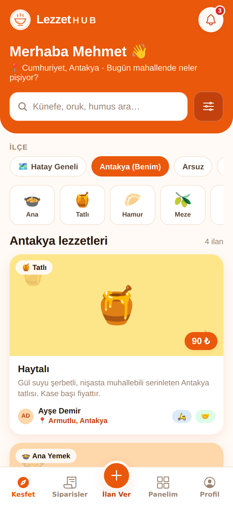
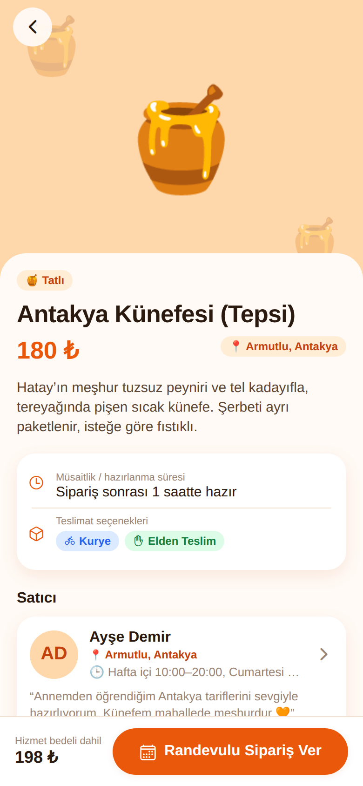
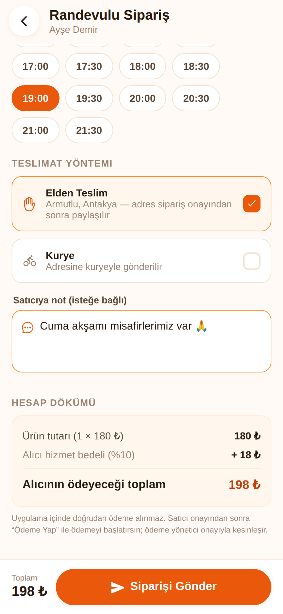
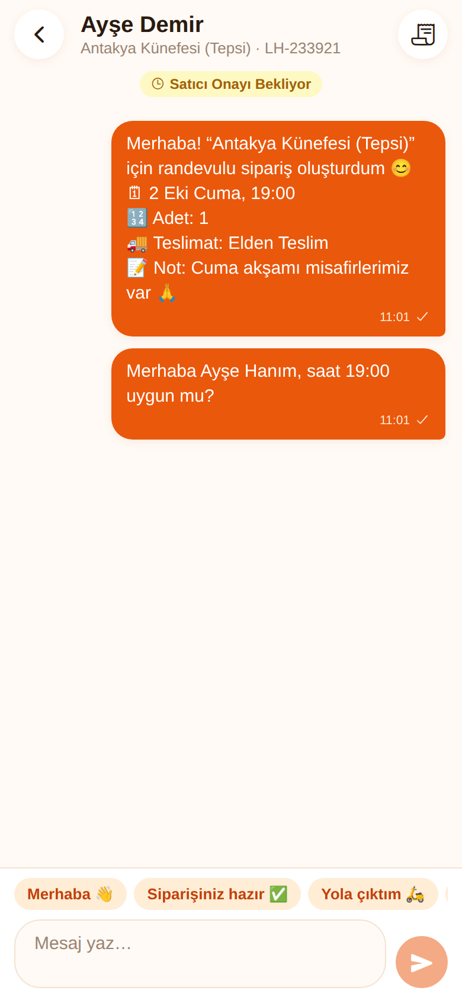
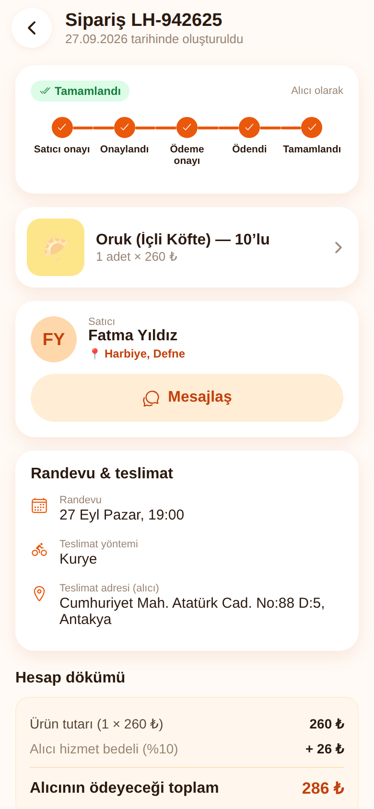
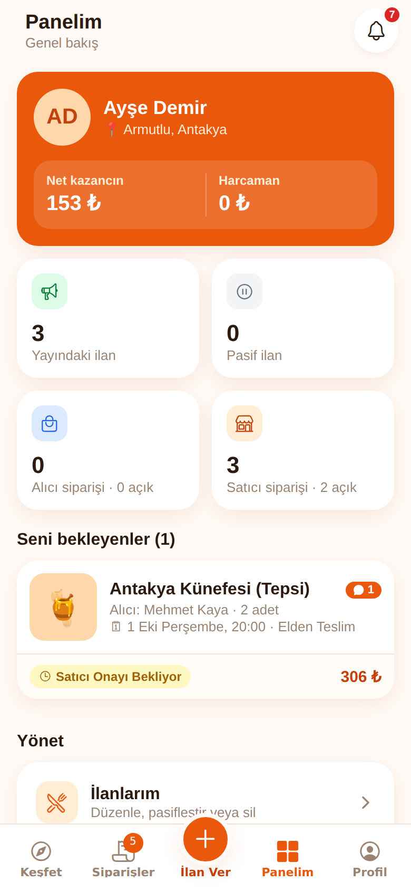
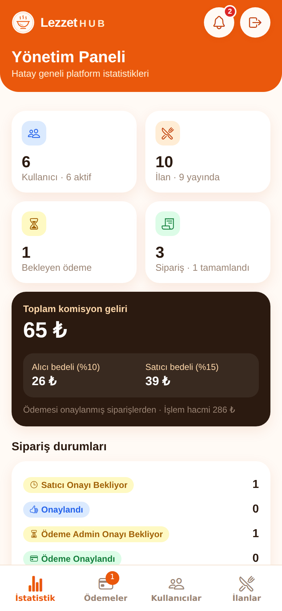
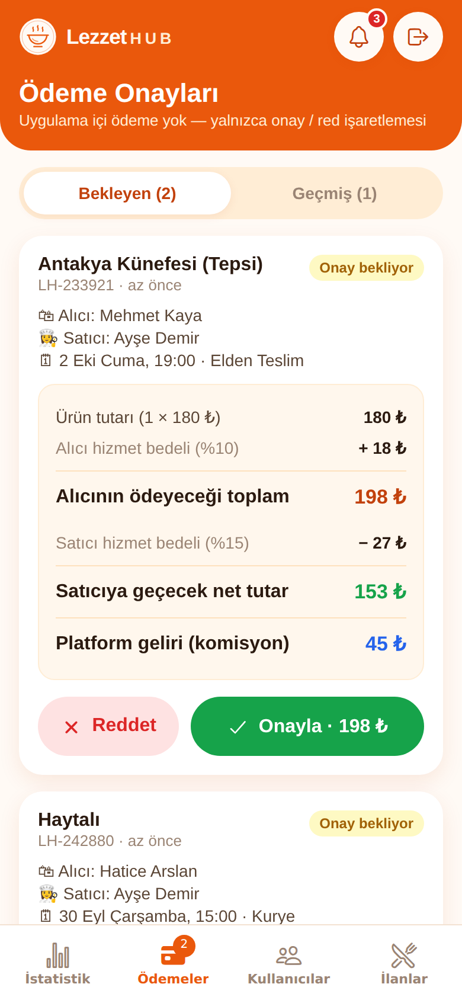

# LezzetHub — Hatay’ın Ev Lezzetleri

Hatay iline özel, ev yemeği satıcılarıyla alıcıları **ilçe + mahalle** detayında buluşturan, randevulu sipariş ve admin onaylı ödeme akışına sahip marketplace mobil uygulaması.

Expo (React Native) + Expo Router + TypeScript ile yazıldı. iOS, Android ve web’de çalışır.

| Ana sayfa | İlan detayı | Randevulu sipariş | Mesajlaşma |
|---|---|---|---|
|  |  |  |  |

| Sipariş detayı | Kullanıcı paneli | Admin istatistik | Ödeme onayları |
|---|---|---|---|
|  |  |  |  |

## Çalıştırma

```bash
cd lezzethub-app
npm install
npx expo start          # QR kodu Expo Go ile okut (iOS / Android)
npx expo start --web    # tarayıcıda aç
```

Kontroller: `npx tsc --noEmit` (tip kontrolü), `npx expo lint` (lint), `npx expo export -p web` (web derlemesi).

### Demo hesaplar

Giriş ekranında tek dokunuşla giriş yapılabilir. İstediğin an **Profil → Demo verilerini sıfırla** ile başlangıç verisine dönebilirsin.

| Rol | E-posta | Şifre | Konum |
|---|---|---|---|
| Admin | admin@lezzethub.com | admin123 | — |
| Satıcı (Ayşe) | ayse@lezzethub.com | 123456 | Antakya · Armutlu |
| Alıcı (Mehmet) | mehmet@lezzethub.com | 123456 | Antakya · Cumhuriyet |
| Diğer satıcılar | fatma@ / hatice@ / zeynep@lezzethub.com | 123456 | Defne, İskenderun, Samandağ |

**Örnek senaryo:** Mehmet olarak gir → Ayşe’nin *Antakya Künefesi* ilanını aç → Cuma akşamına randevulu sipariş ver (Elden Teslim) → Ayşe ile gir, siparişi onayla → Mehmet ile “Ödeme Yap” → Admin ile **Ödemeler** sekmesinden onayla → Ayşe veya Mehmet “Tamamlandı” işaretlesin. Süreç boyunca sipariş sohbetinden mesajlaşılır.

## Özellikler

- **Kapsam:** Yalnızca Hatay. 15 ilçe (Antakya, Arsuz, Altınözü, Belen, Defne, Dörtyol, Erzin, Hassa, İskenderun, Kırıkhan, Kumlu, Payas, Reyhanlı, Samandağ, Yayladağı) ve her ilçe için mahalle önerileri. Listede olmayan mahalle serbestçe yazılabilir.
- **Roller:** Ziyaretçi (ilanları gezer, filtreler), Kullanıcı (hem alıcı hem satıcı), Admin. Herkes aynı ekrandan giriş yapar, role göre yönlendirilir.
- **Ana sayfa:** Varsayılan olarak kullanıcının kendi ilçesi. İlçe filtresi (15 ilçe + Hatay Geneli), mahalle arama (öneri destekli), metin arama, kategori filtresi.
- **İlanlar:** Görsel (galeri/kamera), başlık, açıklama, fiyat, kategori, hazırlanma süresi, teslimat (Kurye / Elden Teslim, en az biri zorunlu), Yayında/Pasif. Konum satıcının profilinden otomatik alınır.
- **Randevulu sipariş:** Adet, gün + saat seçimi, teslimat yöntemi, not. Kurye seçilince adres profilden dolar. Farklı ilçedeki satıcı için uyarı gösterilir.
- **Sipariş durumları:** Satıcı Onayı Bekliyor → Onaylandı → Ödeme Admin Onayı Bekliyor → Ödeme Onaylandı → Tamamlandı (her aşamada Reddedildi / İptal).
- **Ödeme:** Uygulama içinde para alınmaz; alıcı “Ödeme Yap” der, admin onaylar veya reddeder.
- **Komisyon:** Alıcıdan %10 (ürün tutarına eklenir), satıcıdan %15 (tutardan düşülür). Hesap dökümü sipariş oluşturma ve detay ekranlarında satır satır gösterilir. Admin panelinde toplam komisyon geliri görünür.
- **Mesajlaşma:** Her siparişin kendi sohbeti; sipariş açılınca otomatik ilk mesaj, zaman damgalı balonlar, hızlı yanıtlar, durum değişikliklerinde sistem mesajı.
- **Bildirimler:** Sipariş ve mesaj olayları için uygulama içi bildirim merkezi ve sekme rozetleri.
- **Kullanıcı paneli:** Genel bakış, İlanlarım (düzenle / pasifleştir / sil), Siparişlerim (Alıcı / Satıcı sekmeleri), Profilim (bio, ilçe, mahalle, adres, müsaitlik, şifre, avatar).
- **Admin paneli:** İstatistikler (kullanıcı, ilan, bekleyen ödeme, komisyon geliri, ilçe dağılımı), Ödeme Onayları, Kullanıcı Yönetimi (aktif/pasif, admin yap/al, sil), İlan Yönetimi (yayından kaldır, sil).

## Proje yapısı

```
src/
  app/                  Expo Router ekranları
    (tabs)/             Keşfet, Siparişler, İlan Ver, Panelim, Profil
    admin/              İstatistik, Ödemeler, Kullanıcılar, İlanlar
    listing/[id].tsx    İlan detayı
    listing-form.tsx    İlan ekle / düzenle
    order/new.tsx       Randevulu sipariş
    order/[id].tsx      Sipariş detayı ve işlemler
    chat/[id].tsx       Sipariş sohbeti
    user/[id].tsx       Satıcı profili
    login.tsx, register.tsx, my-listings.tsx, notifications.tsx
  components/           Arayüz kiti, ilan kartı, ilçe/mahalle seçici, hesap dökümü, logo
  lib/
    api.ts              İş kuralları (kayıt, ilan, sipariş akışı, mesaj, admin)
    commission.ts       %10 / %15 komisyon hesabı
    hatay.ts            İlçeler ve mahalle önerileri
    store.tsx           Uygulama durumu ve kalıcılık (AsyncStorage)
    seed.ts             Demo verisi
    types.ts            Veri modeli (Kullanıcılar, İlanlar, Siparişler, Mesajlar, Ödemeler)
```

## Veri ve backend notu

Bu sürüm tüm veriyi cihazda (`AsyncStorage`) tutar. Bu yüzden demo hesaplar arasında aynı cihazda geçiş yaparak tüm akışı uçtan uca deneyebilirsin. Şifreler SHA-256 ile özetlenir ama cihaz içinde saklandığından bu gerçek bir sunucu güvenliği sağlamaz.

Canlıya çıkmadan önce yapılması gerekenler:

1. `src/lib/api.ts` içindeki fonksiyonları bir backend’e (Supabase, Firebase ya da REST API) taşı. Fonksiyon imzaları buna uygun tasarlandı.
2. Kimlik doğrulama, görsel depolama ve yetki kontrollerini sunucuya al.
3. Uzak push bildirimleri için `expo-notifications` ekle (şu an bildirimler uygulama içinde).
