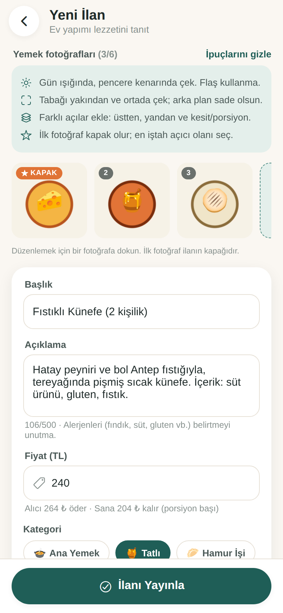
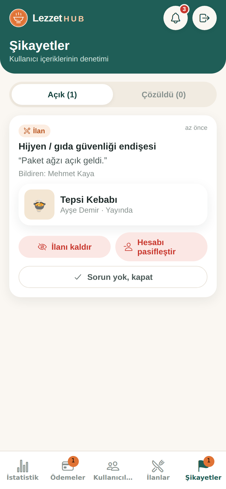

# LezzetHub — Hatay’ın Ev Lezzetleri

Hatay iline özel, ev yemeği satıcılarıyla alıcıları **ilçe + mahalle** detayında buluşturan, randevulu sipariş ve admin onaylı ödeme akışına sahip marketplace mobil uygulaması.

Expo (React Native) + Expo Router + TypeScript ile yazıldı; iOS, Android ve web’de çalışır. Veriler **Supabase** (PostgreSQL + Auth + Storage + Realtime) üzerinde tutulur. Supabase ayarlanmadığında uygulama, cihaz içi **demo modunda** çalışır.

| Ana sayfa | Fotoğraflı ilan | Fotoğraf yükleme | Randevulu sipariş |
|---|---|---|---|
|  |  |  |  |

| Mesajlaşma | Sipariş detayı | Admin istatistik | Admin şikayetler |
|---|---|---|---|
|  |  |  |  |

---

## 1. Hızlı başlangıç (demo modu)

**Windows’ta en kolay yol:** ZIP’i çıkardıktan sonra ana klasördeki **`LezzetHub-Baslat.bat`** dosyasına çift tıkla. Gerekli paketleri kurar ve telefonla okutacağın QR kodu açar ([Node.js](https://nodejs.org) kurulu olmalı).

Elle çalıştırmak için:

```bash
cd lezzethub-app
npm install
npx expo start          # QR kodu telefondaki Expo Go ile okut
npx expo start --web    # tarayıcıda aç
```

Demo modunda giriş ekranında tek dokunuşla giriş yapılan hesaplar vardır: **Admin** (`admin@lezzethub.com` / `admin123`), **Ayşe – Satıcı** ve **Mehmet – Alıcı** (şifre `123456`). Demo verisi yalnızca o cihazda tutulur; **Profil → Demo verilerini sıfırla** ile başa dönülür.

## 2. Canlı mod: Supabase kurulumu (yaklaşık 15 dakika)

Canlı modda tüm kullanıcılar aynı veritabanını kullanır: Ayşe’nin ilanını Mehmet kendi telefonunda görür, mesajlar ve bildirimler anında düşer.

1. **Proje aç:** https://supabase.com → ücretsiz hesap → *New project* (bölge olarak Frankfurt önerilir).
2. **Veritabanını kur:** Supabase panelinde *SQL Editor → New query*. Sırasıyla şu dosyaların içeriğini yapıştırıp **Run** de:
   1. `supabase/schema.sql`: tablolar, güvenlik kuralları, sipariş akışı
   2. `supabase/storage.sql`: fotoğraf depolama
   3. `supabase/realtime.sql`: anlık güncellemeler
3. **Kimlik doğrulama ayarları:** *Authentication → URL Configuration*
   - *Site URL:* web sürümünün adresi (ör. `https://www.lezzethub.com`)
   - *Redirect URLs:* `lezzethub://**` ve `https://www.lezzethub.com/**` ekle (e-posta doğrulama ve şifre sıfırlama bağlantıları için)
   - İstersen *Authentication → Emails* bölümünden e-posta şablonlarını Türkçeleştir.
4. **Uygulamayı bağla:** `lezzethub-app/.env.example` dosyasını `.env` adıyla kopyala ve *Project Settings → API* sayfasındaki değerleri yaz:
   ```
   EXPO_PUBLIC_SUPABASE_URL=https://xxxx.supabase.co
   EXPO_PUBLIC_SUPABASE_ANON_KEY=eyJ...
   ```
   Uygulamayı yeniden başlat (`npx expo start -c`). Giriş ekranındaki demo bölümü kaybolur, "Şifremi unuttum" görünür.
5. **İlk admini ata:** Uygulamadan normal şekilde kayıt ol. Ardından `supabase/make-admin.sql` içindeki e-postayı kendi adresinle değiştirip SQL Editor’de çalıştır. Diğer adminleri uygulamadaki **Admin → Kullanıcılar** ekranından atayabilirsin.

**Güvenlik modeli:** İstemci tablolara doğrudan yazamaz. Tüm değişiklikler sunucu fonksiyonlarıyla yapılır; komisyon, sipariş durum geçişleri ve yetki kontrolleri sunucuda uygulanır. Okumalar satır düzeyi güvenlikle (RLS) sınırlıdır: e-posta ve açık adres yalnızca sahibine ve adminlere görünür, mesajları yalnızca siparişin tarafları okuyabilir.

## 3. Özellikler

- **Kapsam:** Yalnızca Hatay. 15 ilçe ve her ilçe için mahalle önerileri; listede olmayan mahalle serbestçe yazılabilir.
- **Roller:** Ziyaretçi, Kullanıcı (hem alıcı hem satıcı) ve Admin. Hepsi aynı ekrandan giriş yapar, role göre yönlendirilir.
- **Ana sayfa:** Varsayılan olarak kullanıcının ilçesi gösterilir. İlçe (15 + Hatay Geneli), mahalle, metin ve kategori filtreleri var.
- **Yemek fotoğrafları ve pazarlama:**
  - İlan başına 6 fotoğrafa kadar ekleme; kamerayla çekim veya galeriden çoklu seçim
  - Kapak seçme, sıralama, silme; otomatik sıkıştırma
  - Fotoğraf çekim ipuçları
  - İlan detayında kaydırmalı galeri ve tam ekran görüntüleyici
  - **Bağlantıyı paylaş** (WhatsApp, Instagram vb.) ve **fotoğrafı paylaş** (hikâye/durum için; açıklama metni panoya kopyalanır)
- **Randevulu sipariş:** Adet, gün/saat, teslimat yöntemi ve not girilir. Kurye seçilince adres profilden dolar; satıcı farklı ilçedeyse uyarı çıkar. Elden teslimde satıcının açık adresi ancak satıcı onayladıktan sonra alıcıya gösterilir.
- **Durumlar:** Satıcı Onayı Bekliyor → Onaylandı → Ödeme Admin Onayı Bekliyor → Ödeme Onaylandı → Tamamlandı. Her aşamada Reddedildi veya İptal olabilir.
- **Ödeme:** Uygulama içinde para alınmaz. Alıcı "Ödeme Yap" der, admin onaylar veya reddeder.
- **Komisyon:** Alıcıdan %10, satıcıdan %15. Hesap dökümü satır satır gösterilir.
- **Mesajlaşma:** Her siparişin kendi sohbeti var: otomatik ilk mesaj, zaman damgalı balonlar, hızlı yanıtlar, durum değişikliklerinde sistem mesajı.
- **Güven ve güvenlik:**
  - İlan ve kullanıcı şikayeti, kullanıcı engelleme
  - Admin şikayet ekranı: ilanı kaldır, hesabı pasifleştir veya kapat
  - Kullanım koşulları ve KVKK aydınlatma metni; kayıtta onay zorunlu
  - Uygulama içinden hesap silme
- **Paneller:**
  - **Kullanıcı paneli:** genel bakış, İlanlarım, Siparişlerim, Profilim, engellenen kullanıcılar
  - **Admin paneli:** istatistikler, Ödeme Onayları, Kullanıcı ve İlan Yönetimi, Şikayetler

## 4. Testler ve kontroller

```bash
npx tsc --noEmit     # tip kontrolü
npm run lint         # kod kalitesi
npm test             # iş kuralları (82 test): komisyon, sipariş akışı, yetkiler, şikayet/engelleme, hesap silme
npm run test:db      # Supabase şeması (69 test): PGlite üzerinde gerçek PostgreSQL ile RLS, sunucu fonksiyonları
```

## 5. App Store ve Google Play’e yayın

**Gerekenler:**
- Apple Developer Program (yıllık 99 $) ve/veya Google Play Console (bir kerelik 25 $)
- Ücretsiz bir [Expo](https://expo.dev) hesabı

1. **Web sürümünü yayınla** (gizlilik politikası adresi için): `npx expo export -p web` komutu `dist/` klasörünü üretir. Bu klasörü Netlify, Vercel veya Cloudflare Pages’e yükle; tüm yolların `index.html`’e yönlenmesini (SPA) aç. Mağazalara verilecek adresler:
   - Gizlilik politikası: `https://ALANADIN/legal/privacy`
   - Kullanım koşulları: `https://ALANADIN/legal/terms`
2. **Ortam değişkenleri:** `.env` dosyasındaki değerleri expo.dev’de projenin *Environment variables* bölümüne "preview" ve "production" ortamları için gir (ya da `npx eas-cli@latest env:create`).
3. **Derle:**
   ```bash
   npx eas-cli@latest login
   npx eas-cli@latest init
   npx eas-cli@latest build --profile preview --platform android   # telefona kurulabilir APK (test için)
   npx eas-cli@latest build --profile production --platform all    # mağaza sürümleri
   ```
4. **Gönder:**
   ```bash
   npx eas-cli@latest submit --platform android
   npx eas-cli@latest submit --platform ios
   ```
5. **Mağaza kontrol listesi:**
   - [ ] `src/lib/legal.ts` içindeki [köşeli parantez] alanlarını doldur ve metinleri hukukçuya kontrol ettir
   - [ ] `EXPO_PUBLIC_SUPPORT_EMAIL` ile gerçek bir destek adresi tanımla
   - [ ] Uygulama incelemesi için bir test hesabı oluştur (Apple istiyor)
   - [ ] Ekran görüntüleri, kısa/uzun açıklama, yaş derecelendirmesi, veri güvenliği formu
   - [ ] Google Play kişisel hesaplarda yayından önce 12 test kullanıcısıyla 14 günlük kapalı test

Karşılanan mağaza şartları: uygulama içi hesap silme, kullanıcı içeriği için şikayet ve engelleme, kayıtta koşul onayı, yalnızca kullanılan izinler (kamera ve galeri; mikrofon kapalı). Yemek fiziksel bir ürün olduğu için Apple/Google uygulama içi satın alma zorunluluğu uygulanmaz.

## 6. Proje yapısı

```
lezzethub-app/
  src/app/              Ekranlar (Expo Router)
    (tabs)/             Keşfet, Siparişler, İlan Ver, Panelim, Profil
    admin/              İstatistik, Ödemeler, Kullanıcılar, İlanlar, Şikayetler
    listing/[id].tsx    İlan detayı (galeri, paylaşım, şikayet)
    listing-form.tsx    İlan ekle/düzenle (fotoğraf yöneticisi)
    order/, chat/       Sipariş oluşturma/detay, sipariş sohbeti
    legal/[doc].tsx     Gizlilik politikası ve kullanım koşulları
    login, register, forgot-password, reset-password, my-listings, notifications, user/[id]
  src/components/       Arayüz kiti, fotoğraf bileşenleri, şikayet penceresi, logo
  src/lib/
    backend/            Veri katmanı: local.ts (demo), supabase.ts (canlı), types.ts (ortak arayüz)
    api.ts              İş kuralları (demo modunda kullanılır; aynı kurallar schema.sql’de)
    photos.ts, share.ts Fotoğraf çekme/sıkıştırma/saklama, paylaşım
    theme.ts            Renk paleti ve tipografi
    hatay.ts, legal.ts, seed.ts, types.ts, commission.ts, config.ts
  supabase/             schema.sql, storage.sql, realtime.sql, make-admin.sql, tests/
  tests/                İş kuralı testleri
```

## 7. Bilinen sınırlar ve sonraki adımlar

- **Push bildirimleri:** Bildirimler şu an uygulama açıkken görünür (uygulama içi merkez ve anlık güncelleme). Uygulama kapalıyken bildirim için `expo-notifications` ve bir Supabase Edge Function eklenmeli.
- **Büyüme:** İlk sürüm, kullanıcının görmeye yetkili olduğu verileri tek seferde çeker. Bu, bölgesel ölçekte (birkaç bin ilan) yeterlidir. Daha büyük ölçekte sayfalama eklenmelidir.
- **Ödeme:** Admin onaylı manuel akış kullanılıyor. İleride iyzico veya PayTR gibi bir ödeme altyapısı entegre edilebilir.
